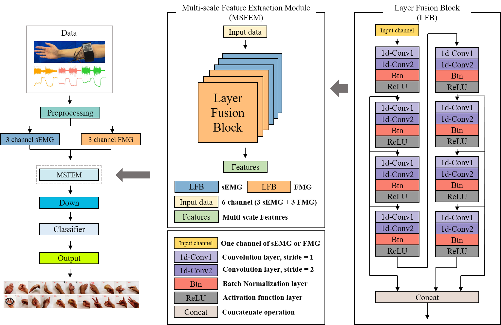

# A-layered-sensor-unit
Code for the machine learning methods and LFCNN in the paper: A layered sEMG-FMG hybrid sensor for hand motion recognition from forearm muscle activities
# Structure of the layerd sEMG-FMG hybrid sensor unit

# LayerFusionNet

# Dataset

>We evaluate the performance of the layered sensor unit and the LayerFusionNet on our dataset, some of our dataset you can see from `a-layered-sensor-unit/electrode_position_survey_experiment/data`

# Requirements

* Python 3.8
* Pytorch 1.11.0
* sklearn 0.24.0

# Function of file

* `a-layered-sensor-unit/main_experiment/model/ml/`
  * train machine learning model (XGBoost, SVM, RandomForest, KNN).
* `model.py`
  * Generate single-branch and two-branch model.

# Usage
We've offered two models:  `SingleSalientModel` and `TwoSteamSalientModel` for single-branch method and two-branch method respectively.
You need to use a tensor with shape: **[None, group_sequence_number , group_sequence_length * sleep_epoch_length, 1, 1]** for the single-branch method while duplicate tensors with the same shape for the two-branch method.
